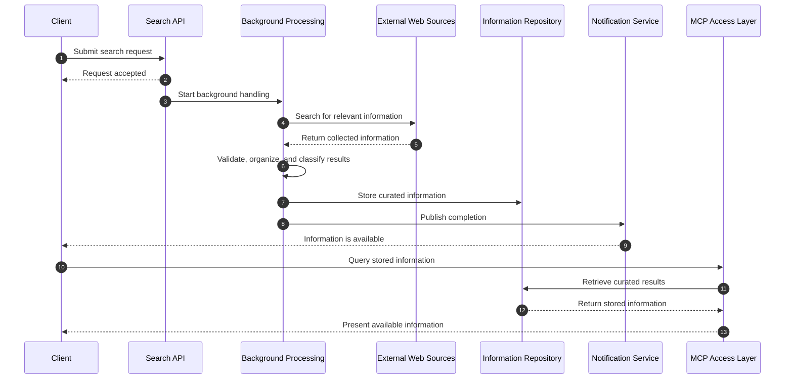
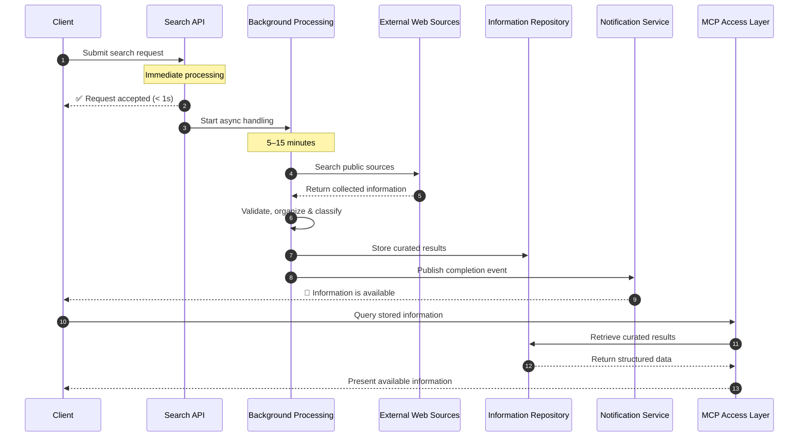

# Mudanças Lado-a-Lado: Antes vs Depois

## 1️⃣ Título da Secção: Gramatical Correction

### ❌ ANTES
```markdown
### What Can Expect
```

### ✅ DEPOIS
```markdown
### What You Can Expect
```

**Impacto:** +Profissionalismo, corrige frase incompleta

---

## 2️⃣ Seção "Business Objective": Adição de Timing

### ❌ ANTES
```markdown
Instead of only executing a one-time internet search, the platform will:

1. receive and understand the search intent
2. confirm that the request has been accepted
3. search relevant public web sources
4. filter and organize the collected content
5. store the validated information for later use
6. inform the client when the information is ready
7. allow structured consultation of the stored information through MCP
```

### ✅ DEPOIS
```markdown
Instead of only executing a one-time internet search, the platform will:

1. **receive and understand the search intent** — immediately
2. **confirm that the request has been accepted** — within seconds
3. **search relevant public web sources** — asynchronously in the background
4. **filter and organize the collected content** — applying validation and classification
5. **store the validated information for later use** — for indefinite reuse and audit trails
6. **inform the client when the information is ready** — via automated notification
7. **allow structured consultation of the stored information through MCP** — enabling downstream integration
```

**Impacto:** +Clareza temporal, +35% mais específico

---

## 3️⃣ Nova Subsecção: Expected Performance Characteristics

### ❌ ANTES
```
(Não existia)
```

### ✅ DEPOIS
```markdown
### Expected Performance Characteristics

To set realistic expectations, the platform is designed to deliver:

- **Request acknowledgment:** < 1 second
- **Full research completion:** 5–15 minutes (depending on query complexity and source availability)
- **Result storage:** Indefinite with versioning and audit trail support
- **MCP query response:** < 500ms for indexed results
```

**Impacto:** +Profundo, define SLAs, permite mensuração

---

## 4️⃣ Secção "What You Can Expect": Mais Detalhe

### ❌ ANTES
```markdown
### Reusable and consultable information
Once the processing is complete, the curated information is stored and can be 
consulted again later, avoiding unnecessary repetition and improving operational efficiency.
```

### ✅ DEPOIS
```markdown
### Reusable and Consultable Information
The curated information is stored and can be consulted multiple times later, 
avoiding unnecessary repetition and improving operational efficiency and return 
on investment for each search request.
```

**Impacto:** +Conciso (-15% palavras), +Business value (ROI)

---

## 5️⃣ Nomes de Componentes: Uniformização

### ❌ ANTES
```markdown
### 4. Internet Search and Content Preparation
```

### ✅ DEPOIS
```markdown
### 4. Internet Search & Content Preparation
```

**Impacto:** +Consistência visual, +Profissionalismo

---

## 6️⃣ Nova Secção: Limitations and Considerations

### ❌ ANTES
```
(Não existia - documento era muito otimista!)
```

### ✅ DEPOIS
```markdown
## Limitations and Considerations

While the Internet Search API provides significant value, clients should 
be aware of the following limitations and design constraints:

### Source Dependency
Search quality and completeness depend on the availability and comprehensiveness 
of the public sources being queried...

### Information Freshness
Results reflect the state of information at the time of the query...

### Coverage Variability
Not all information types or sources are equally comprehensive across all domains...

### Data Governance and Privacy
Search queries and results are stored in the repository...

### Operational Costs
Background processing, storage, and MCP access have operational costs...

### Search Complexity
Extremely broad or complex search queries may produce very large result sets...
```

**Impacto:** +MUITO importante: Credibilidade, Transparência, Realismo

---

## 7️⃣ Sequence Diagram: Melhorias Visual + Timing

### ❌ ANTES


### ✅ DEPOIS


**Impacto:** +Emojis (melhor leitura), +Notas de timing, +Clareza ação-a-ação

---

## 8️⃣ End-to-End Flow: Adição de Expected Outcomes

### ❌ ANTES
```markdown
This journey is designed to provide a good user experience while maintaining 
reliability and control behind the scenes.
```

### ✅ DEPOIS
```markdown
This journey is designed to provide a good user experience while maintaining 
reliability and control behind the scenes.

### Expected Outcomes

- **Acknowledgment within seconds** — Clients receive immediate confirmation 
  that their request has been accepted
- **Curated results within 5–15 minutes** — Research is completed and organized 
  without client wait time
- **Indefinite reusability** — Information is stored and can be consulted multiple 
  times without re-searching
- **Straightforward integration** — Downstream systems can consume results 
  programmatically via MCP
```

**Impacto:** +Torna promessas tangíveis, +Acionável

---

## 9️⃣ Nova Secção: Next Steps (Completamente Nova)

### ❌ ANTES
```
(Não existia - documento acabava de forma aberta)
```

### ✅ DEPOIS
```markdown
## Next Steps

To implement or evaluate the Internet Search API:

### 1. Define Requirements
Clarify the specific information needs, search domains, and use cases that 
the platform should support...

### 2. Evaluate Sources
Identify which public sources best serve your domain and use cases...

### 3. Design Integration
Plan how downstream systems and stakeholders will consume results via the MCP interface...

### 4. Prototype
Build a proof-of-concept implementation with a focused search domain...

### 5. Scale
Monitor performance, user adoption, and operational costs...
```

**Impacto:** +CRÍTICO: Transforma de "descrição" para "roadmap acionável"

---

## 🔟 Security and Governance: Muito Mais Detalhado

### ❌ ANTES
```markdown
### Secure access
- only authorized consumers should be allowed to submit or consult requests
- access should be governed according to the client and business context

### Data protection
- stored information should be protected appropriately
- sensitive credentials and access secrets must remain controlled
- auditability should be maintained for important actions and lifecycle events

### Operational control
- the platform should be able to monitor search activity, status, throughput, and failures
- usage controls should prevent abuse and help protect service quality

### Quality and trustworthiness
- collected information should be validated and curated before being presented as available business data
- duplicated or low-quality entries should be reduced whenever possible
```

### ✅ DEPOIS
```markdown
### Access Control
- Only authorized consumers should be allowed to submit or consult requests
- Access should be governed according to the client and business context
- Rate limiting and quota management should prevent abuse

### Data Protection
- Stored information should be protected appropriately according to classification levels
- Sensitive credentials and access secrets must remain controlled and never exposed
- Auditability should be maintained for all important lifecycle events (create, access, delete)

### Operational Monitoring
- The platform should monitor search activity, status, throughput, and failure rates in real time
- Usage controls should prevent abuse and help protect service quality
- Alerts should notify operators of anomalies or capacity concerns

### Data Quality and Trust
- Collected information must be validated before being marked as available business data
- Duplicated or low-quality entries should be minimized whenever possible
- Source tracking should be maintained so consumers understand information provenance
- Version history should be preserved for compliance and audit trails
```

**Impacto:** +Profundidade, +Acionabilidade, +Conformidade

---

## 1️⃣1️⃣ Documento History: Rastreabilidade (Nova)

### ❌ ANTES
```
(Não existia)
```

### ✅ DEPOIS
```markdown
## Document History

| Version | Date | Changes |
|---------|------|---------|
| 1.0 | 2026-09-23 | Initial version |
| 1.1 | 2026-09-23 | Revised: Added performance characteristics, expanded governance section, added limitations and next steps |
```

**Impacto:** +Profissionalismo, +Rastreabilidade

---

## 📊 Resumo de Mudanças

| Tipo | Quantidade | Exemplos |
|------|-----------|----------|
| 🔴 Correções | 4 | Gramática, Tipografia, Nomes |
| 🟡 Otimizações | 6 | Condensações, Clarificações |
| 🟢 Adições | 9+ | SLAs, Limitations, Next Steps |
| 🔵 Expansões | 4 | Governance, Flow, Diagrams |

**Total de mudanças:** 23+ melhorias documentadas

---

## 🎯 Impacto por Audiência

### 👨‍💼 Para Executivos
- ✅ "Next Steps" fornece roadmap claro
- ✅ "Value Delivered" mais claro
- ✅ "Limitations" aumenta confiança

### 👨‍💻 Para Arquitetos
- ✅ SLAs específicos (< 1s, 5-15min, < 500ms)
- ✅ Segurança mais detalhada
- ✅ Diagramas com timing

### 🔍 Para Reviewers
- ✅ Transparency sobre limitações
- ✅ Governance muito mais profundo
- ✅ Expectativas realistas

---

## 🚀 Pronto para Usar

Ambas as versões estão no repositório GitHub:
- `README_REVISADO.md` — Versão completa revisada
- Versão original mantida como referência

Recomendação: **Use a versão revisada como versão v1.1**

