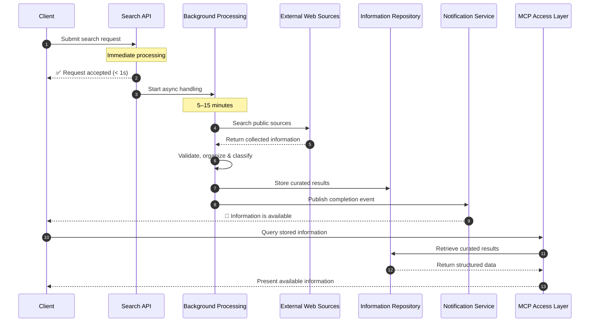
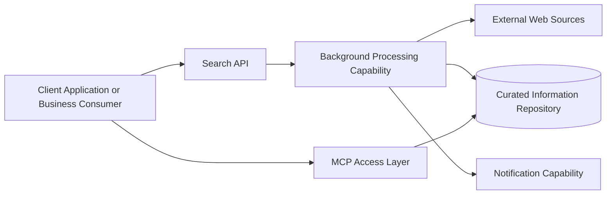

# Internet Search API - Client-Facing Architecture Overview

## Business Objective

The purpose of this solution is to transform a simple search request into a managed information service.

Instead of only executing a one-time internet search, the platform will:

1. **receive and understand the search intent** — immediately
2. **confirm that the request has been accepted** — within seconds
3. **search relevant public web sources** — asynchronously in the background
4. **filter and organize the collected content** — applying validation and classification
5. **store the validated information for later use** — for indefinite reuse and audit trails
6. **inform the client when the information is ready** — via automated notification
7. **allow structured consultation of the stored information through MCP** — enabling downstream integration

This makes the service suitable not only for immediate use, but also for reuse, auditability, and integration with other digital channels.

---

## What You Can Expect

### Fast Response to New Requests
The platform is designed to acknowledge receipt of a search request immediately—within seconds—without forcing the client to wait for the full internet research cycle.

### Reliable Background Processing
The actual search and information preparation take place asynchronously in the background, allowing the platform to remain responsive even when external web sources are slower or temporarily unavailable.

### Curated Results Instead of Raw Web Output
The solution does not simply return unfiltered search results. It applies validation, organization, and classification so that the final output is more useful, more consistent, and easier to consume.

### Reusable and Consultable Information
The curated information is stored and can be consulted multiple times later, avoiding unnecessary repetition and improving operational efficiency and return on investment for each search request.

### Structured Access Through MCP
The final information is exposed through an MCP interface, enabling intelligent systems and downstream consumers to query the stored results in a consistent and structured way.

### Expected Performance Characteristics

To set realistic expectations, the platform is designed to deliver:

- **Request acknowledgment:** < 1 second
- **Full research completion:** 5–15 minutes (depending on query complexity and source availability)
- **Result storage:** Indefinite with versioning and audit trail support
- **MCP query response:** < 500ms for indexed results

---

## High-Level Architecture

The architecture is organized around a simple principle:

> **Accept quickly, process carefully, store reliably, and expose clearly.**

At a high level, the platform includes the following business capabilities:

### 1. Client Access
This is the entry point used by the client application or business consumer.

Its role is to:
- Submit search requests
- Receive immediate acknowledgment
- Receive notification when results are available
- Consult available results

### 2. Search API
This is the front door of the platform.

Its role is to:
- Receive the request
- Validate that the request is acceptable
- Organize the request into a standard internal format
- Confirm acceptance immediately

### 3. Processing Orchestration
This capability ensures that the request is handled in a controlled and scalable way.

Its role is to:
- Move the request into background processing
- Protect the platform from delays caused by external sources
- Support scalability as demand grows

### 4. Internet Search & Content Preparation
This capability performs the actual research and information refinement.

Its role is to:
- Search external web sources
- Collect relevant articles and references
- Remove duplicate information
- Validate and classify content
- Prepare a curated result set

### 5. Information Repository
This is the long-term knowledge store of the solution.

Its role is to:
- Keep the accepted requests
- Keep the processed results
- Preserve traceability and historical visibility
- Support consultation and reporting
- Maintain version history for audit compliance

### 6. Notification Capability
This capability informs interested consumers when the requested information becomes available.

Its role is to:
- Communicate completion
- Improve the end-user experience
- Avoid constant manual status checking

### 7. MCP Access Layer
This capability exposes the curated information in a structured way for intelligent consumers.

Its role is to:
- Provide controlled access to stored search results
- Enable reuse of the information by AI-enabled or MCP-compatible consumers
- Separate information consumption from information collection
- Support programmatic integration with downstream systems

---

## Architecture Principles

The proposed solution follows well-established architecture principles appropriate for client-facing enterprise platforms.

### Separation of Responsibilities
Each major capability has a clear role: receiving requests, processing information, storing results, notifying users, and exposing curated data. This separation enables independent scaling and maintenance of each component.

### Responsiveness
The platform answers quickly at the start of the process, while the more time-consuming research activities happen in the background. Clients never wait for external sources.

### Scalability
The design allows the search workload to grow independently from the client-facing entry point. Processing can be distributed across multiple workers and scheduled intelligently.

### Resilience
External search providers may be slower or temporarily unavailable. The architecture reduces the impact of those variations on the client experience through timeouts, retries, and graceful degradation.

### Reusability
Processed information is stored and made available for later consultation, rather than being treated as a disposable response. This increases the ROI of each search investment.

### Controlled Exposure
The MCP layer provides a clear and governed way to access stored information without coupling consumers to the internal processing flow. Access can be audited and controlled per client.

---

## Security and Governance Considerations

Although this document is intentionally high-level, the solution is expected to follow modern architecture best practices in the following areas:

### Access Control
- Only authorized consumers should be allowed to submit or consult requests
- Access should be governed according to the client and business context
- Rate limiting and quota management should prevent abuse

### Data Protection
- Stored information should be protected appropriately according to classification levels
- Sensitive credentials and access secrets must remain controlled and never exposed
- Auditability should be maintained for all important lifecycle events (create, access, delete)

### Operational Monitoring
- The platform should monitor search activity, status, throughput, and failure rates in real time
- Usage controls should prevent abuse and help protect service quality
- Alerts should notify operators of anomalies or capacity concerns

### Data Quality and Trust
- Collected information must be validated before being marked as available business data
- Duplicated or low-quality entries should be minimized whenever possible
- Source tracking should be maintained so consumers understand information provenance
- Version history should be preserved for compliance and audit trails

---

## End-to-End Service Flow

From the client point of view, the service behaves as follows:

1. A client submits a request describing the information to be searched.
2. The platform reviews the request and confirms that it has been accepted.
3. The search is performed in the background.
4. Relevant articles and references are collected.
5. The collected information is cleaned, checked, and organized.
6. The curated information is stored for consultation.
7. The client is informed that the results are available.
8. The stored information can then be accessed through the MCP interface.

### Expected Outcomes

- **Acknowledgment within seconds** — Clients receive immediate confirmation that their request has been accepted
- **Curated results within 5–15 minutes** — Research is completed and organized without client wait time
- **Indefinite reusability** — Information is stored and can be consulted multiple times without re-searching
- **Straightforward integration** — Downstream systems can consume results programmatically via MCP

---

## Sequence Diagram

---

## Context Diagram

---

## Limitations and Considerations

While the Internet Search API provides significant value, clients should be aware of the following limitations and design constraints:

### Source Dependency
Search quality and completeness depend on the availability and comprehensiveness of the public sources being queried. Source unavailability or changes in source structure may impact results.

### Information Freshness
Results reflect the state of information at the time of the query. If the information landscape changes after the search is complete, a new search is required to obtain updated results.

### Coverage Variability
Not all information types or sources are equally comprehensive across all domains. Specialized or niche topics may have limited coverage in public sources.

### Data Governance and Privacy
Search queries and results are stored in the repository for audit and reuse purposes. Appropriate data governance policies must be in place to protect sensitive information and comply with regulations (GDPR, etc.).

### Operational Costs
Background processing, storage, and MCP access have operational costs that scale with usage volume and query complexity. Clients should monitor usage patterns and set appropriate quotas.

### Search Complexity
Extremely broad or complex search queries may produce very large result sets. Scope and filtering should be used to keep results manageable and relevant.

---

## Value Delivered to the Client

This architecture is intended to deliver the following business value:

- **Speed:** Requests are accepted immediately; clients are never blocked by external sources
- **Clarity:** The client knows exactly when information is available and can plan downstream processes accordingly
- **Quality:** Results are curated and validated rather than simply forwarded from web search engines
- **Consistency:** Information is stored and exposed in a structured, queryable format
- **Reusability:** Information can be consulted multiple times without re-searching, improving ROI
- **Scalability:** The platform can evolve as usage grows; capacity is independent of client growth
- **Integration:** MCP exposure enables broader intelligent consumption scenarios and downstream automation
- **Auditability:** Full lifecycle tracking and version history support compliance and governance needs

---

## Next Steps

To implement or evaluate the Internet Search API:

### 1. Define Requirements
Clarify the specific information needs, search domains, and use cases that the platform should support. Establish priorities and success criteria.

### 2. Evaluate Sources
Identify which public sources best serve your domain and use cases. Assess source reliability, coverage, update frequency, and access policies.

### 3. Design Integration
Plan how downstream systems and stakeholders will consume results via the MCP interface. Define data formats, access patterns, and performance requirements.

### 4. Prototype
Build a proof-of-concept implementation with a focused search domain to validate the architecture and validate key assumptions about source quality and research time.

### 5. Scale
Monitor performance, user adoption, and operational costs. Expand based on actual usage patterns, feedback, and business demand.

---

## Conclusion

The proposed Internet Search API is more than a simple search endpoint. It is a managed information service designed to:

- **Receive requests efficiently** — acknowledgment within seconds
- **Perform web research responsibly** — with validation and quality controls
- **Organize the resulting content** — into curated, consistent data
- **Store it reliably** — for audit trails and reuse
- **Make it available through a modern consultation layer** — via MCP for downstream integration

For the client, this means a solution that is:

- **Easy to understand** — simple request → background processing → structured results
- **Fast to interact with** — immediate acknowledgment and notification
- **Reliable in operation** — resilient to external delays and failures
- **Structured for long-term use** — stored, versioned, and auditable
- **Suitable for integration** — MCP-enabled for programmatic consumption

This architecture provides a strong foundation for a professional, secure, and scalable information discovery service that delivers real business value through reusability, quality, and ease of integration.

---

## Document History

| Version | Date | Changes |
|---------|------|---------|
| 1.0 | 2026-09-23 | Initial version |
| 1.1 | 2026-09-23 | Revised: Added performance characteristics, expanded governance section, added limitations and next steps |

